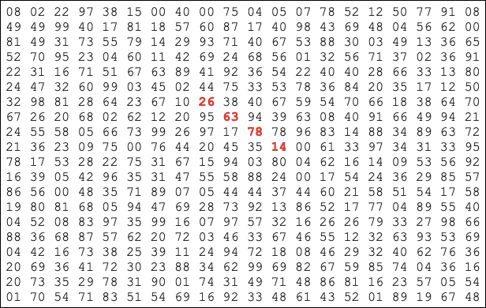

Project Euler Solver: Largest Product in a Grid
===============================================

**largest_prod_grid** is a Python program that solves a mathematics problem posed
by `Project Euler <https://projecteuler.net/>`_:

    Given a 20 x 20 table of numbers, find the largest product of four linearly adjacent numbers. 
    The four numbers can run up, down, left, right, or diagonally.

Project Euler gives this example, where the largest product in a 20 x 20 table is created by multiplying 26, 63, 78, and 14 to get 1788696.

This implementation generalizes the solution -- it can compute the largest product of four adjacent numbers in table that's at least 4 x 4.

The code lives in `this repo <https://github.com/XtinaJohnson/largest_prod_grid/>`_, which also contains two samples text files that contain tables. 

.. note::

   This program reports only the largest product. Future versions will report the four
   factors and their locations in the table.

We describe how to use the program and provide examples of input in :doc:`usage`.

To see how the program is implemented, see :doc:`impl`.

.. toctree::

    usage
    impl
    

Test
See :download:`this example script <../test.txt>`.
